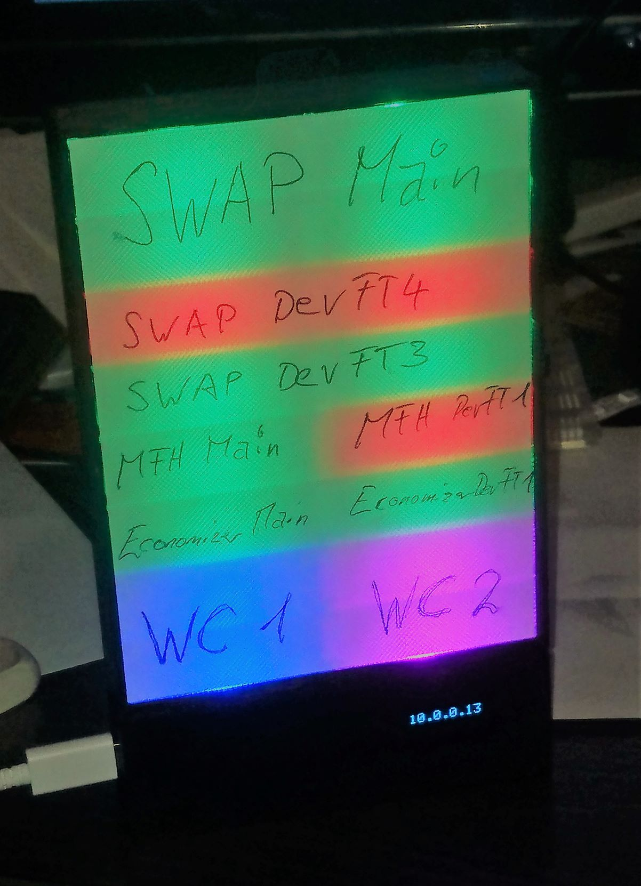
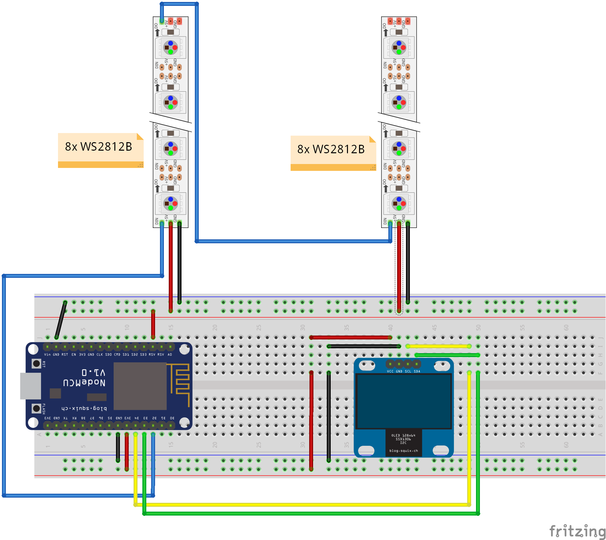
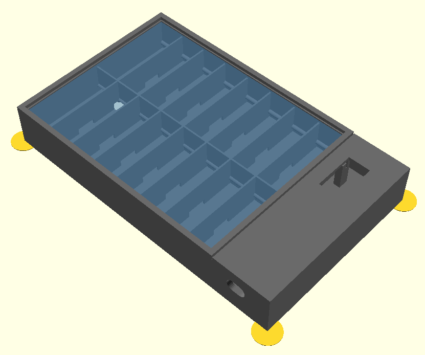
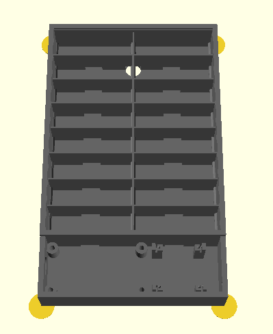

# Build Indicator
This device can show the state of builds or any other thing stored in the firebase database. It can
be configured, which part indicates what and lets the oportunity to meld fields together.

## Status
The actual status of the software is still buggy. It resets if the streaming from the firebase is activated.

## Requirements
* [Arduino IDE](https://www.arduino.cc/en/main/software)
* [ESP8266 board support](https://github.com/arduino/Arduino/wiki/Unofficial-list-of-3rd-party-boards-support-urls): http://arduino.esp8266.com/stable/package_esp8266com_index.json
* [FirebaseArduino library](https://github.com/FirebaseExtended/firebase-arduino)
* ArduinoJson library Version 5.13.1 (higher versions result in problems with the active FirebaseArduino library)
* Adafruit_NeoPixel library
* Adafruit_GFX library
* Adafruit_SSD1306 library
* WiFiManager library
* [Visual Studio](https://visualstudio.microsoft.com/) to have a comfortable IDE
* [Visual Micro](https://www.visualmicro.com/) to integrate Arduino IDE in Visual Studio

## Hardware
The hardware consists of:
* NodeMCU board (any ESP8266 board would do)
* WS2812b programmable RGB-LED stripes 2x8 in series
* SSD1306 OLED display (128x64 pixel)

## Housing / Enclosure
The housing is printed using a 3D-Printer. There is a slit to slide in a transparent foil to write
the lamp configurations on. As background a transparent material can be used for the 3D-printer or
a thin paper which can be laminated for durability.

## Author
[Marco Graf](https://github.com/grafmar)
